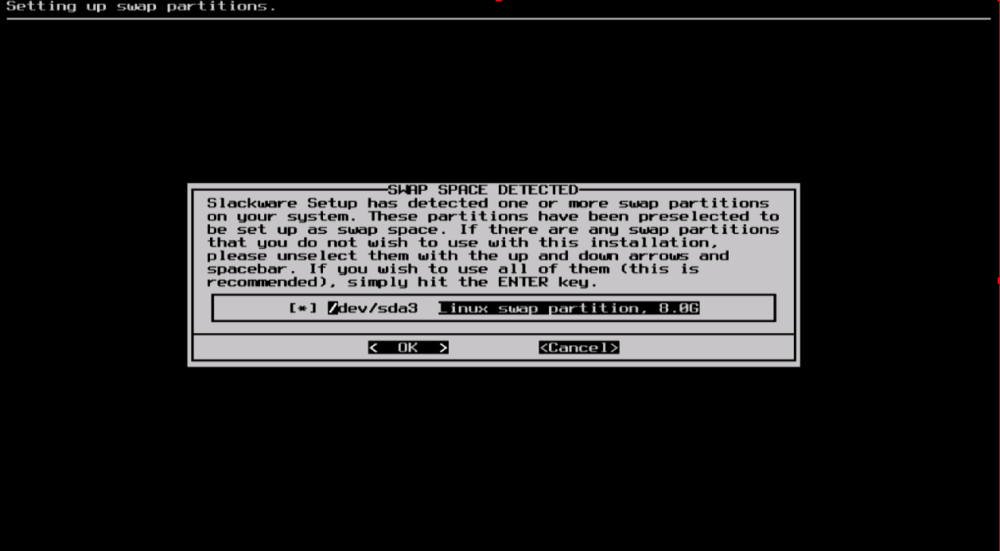

#### Addswap

如果你创建了一个swap分区，这一步允许你在进行与内存有关的活动（比如说安装软件包）之前启用它。swap空间是必要的虚拟内存。这是一个硬盘分区（或者一个文件，尽管Slackware安装器并不支持swap文件），当你的内存用尽时会移出一部分内容到这个分区中。这个交换分区允许你使用比你计算机实际有的物理内存更多的内存空间。这一步也会将swap分区添加到/etc/fstab中，这样在启动系统时就可以获得了。
