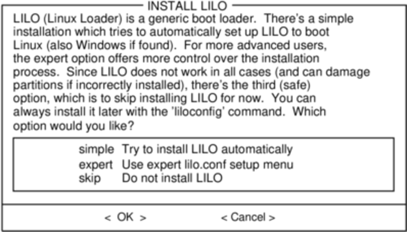
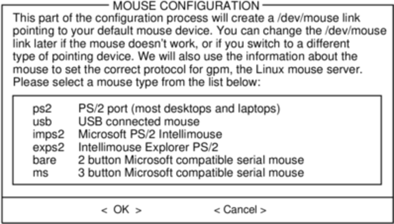
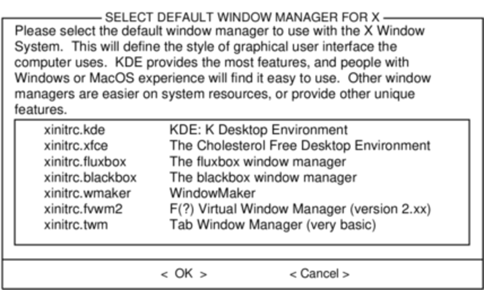

#### Configure

一旦所有的软件包都安装完就快接近结束了。在这一步，Slackware会让你对新的操作系统进行配置。大多数都是可选的，不过大多数用户都需要在这里设置某些东西。取决于你安装的软件包，你可能看到的配置选项和这里不同，我们会包含一些重要的讲。

首先可能会让你制作一个启动盘。过去一般使用1.44MB的软盘，但是如今Linux内核对软盘来说太大了，所以Slackware提供制作一个USB启动盘。当然这也需要你的计算机支持从USB启动。如果你并不打算使用LILO或者其他引导方式，你应该考虑制作一个USB启动盘。请注意这会清除USB上的数据。

LILO用于引导Linux内核和连接initrd或是root文件系统。没有这个，Slackware系统可能不会成功引导。Slackware在这里提供一些选项。"simple"是自动配置LILO。如果你并不信任这个方法或者像详细地看一下如何配置LILO，可以选择"expert"。

LILO是Slackware系统很重要的一部分，所以整个第三章就是在讲这个。如果你对LILO不理解可以先看第三章。

> 译者注：LILO只是可选的引导程序，Slackware在“A”（基本系统）软件包组中同样提供了GRUB2。

下面会让你配置并激活控制台鼠标用于图形化桌面。通过激活控制台鼠标可以方便地在Slackware的终端进行复制和粘贴操作。大部分用户都从前三个选项中进行选择。

下面是配置网络。如果你不想配置网络可以跳过，否则就需要给计算机提供一个主机名。如果你不清楚在做什么可以先看[第十四章](../../chapter_14/README.md)

接下来会让你输入主机名、域名。主机名和域名被用来在使用了内部DNS服务的网络中定位计算机或者配置`/etc/hosts`文件。默认主机名为"darkstar"。

有三种方法可以配置IP地址：分配一个静态的IP、DHCP或者配置环回连接。最简单的是使用DHCP。除非你安装Slackwar是作为网络服务器，这样你可能需要配置静态IP。如果选择配置静态IP，会让你输入IP地址、子网掩码、网关IP地址。最后是确认屏幕。

网络配置结束后会进行启动服务的配置。如果你不确定可以使用默认配置，之后可以通过pkgtool修改。

之后就是设置时间和时区。

如果你之前选择安装X集合，可能会提示你选择一个默认的窗口管理器或者桌面环境。你在这里选择的会应用于系统上的所有用户，除非某个用于运行`xwmconfig`来选择一个不同的。如果你看到的选项和下面的图片不同不要惊慌。`xwmconfig`只提供你安装的。

最后的配置是设置root密码。root用户是Linux中的超级用户。

最后步骤结束后就可以退出Slackware安装器并且重启了。移除安装盘，如果你所有安装步骤都正确则会正常启动Slackware。当你重启并进入Slackware系统后，你首先要做的就是新建一个用户。默认情况下，安装结束后只有root用户，如果使用root用户操作系统会有危险。

最简单的创建用户的方法就是先以root用户身份登录，然后输入`adduser`命令，详情见[管理用户和组](../../chapter_09/Managing_Users_and_Groups.md)章节。

