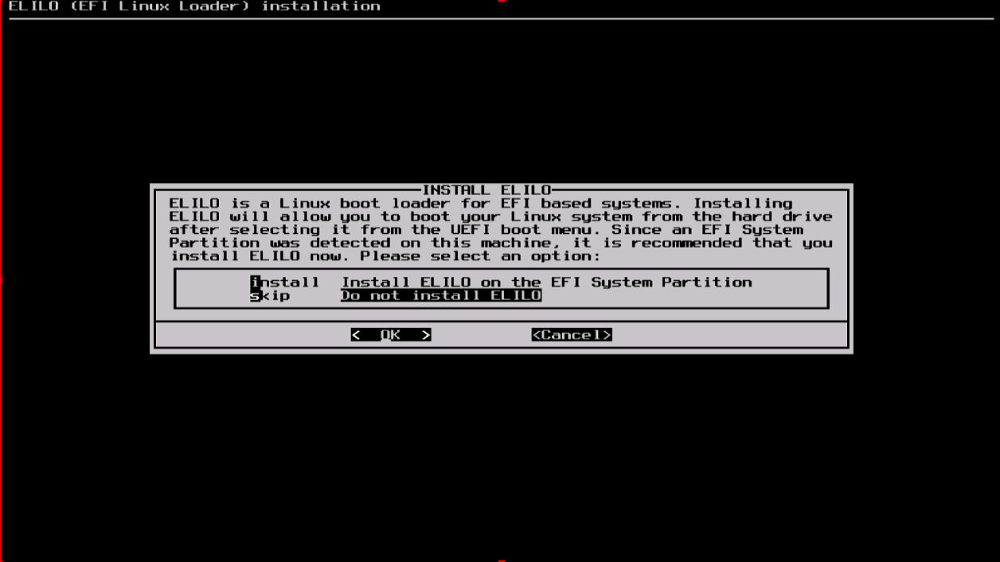
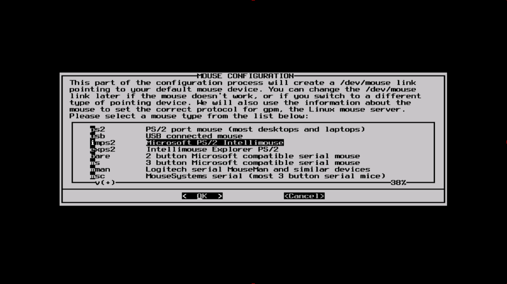
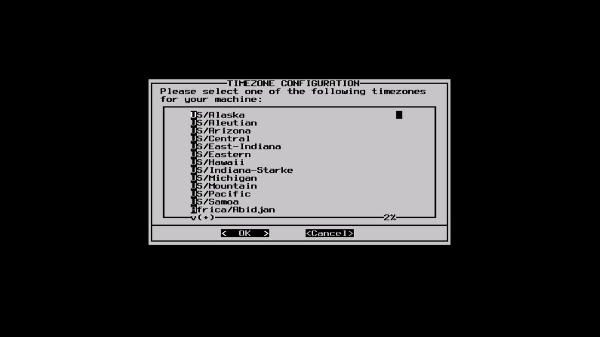
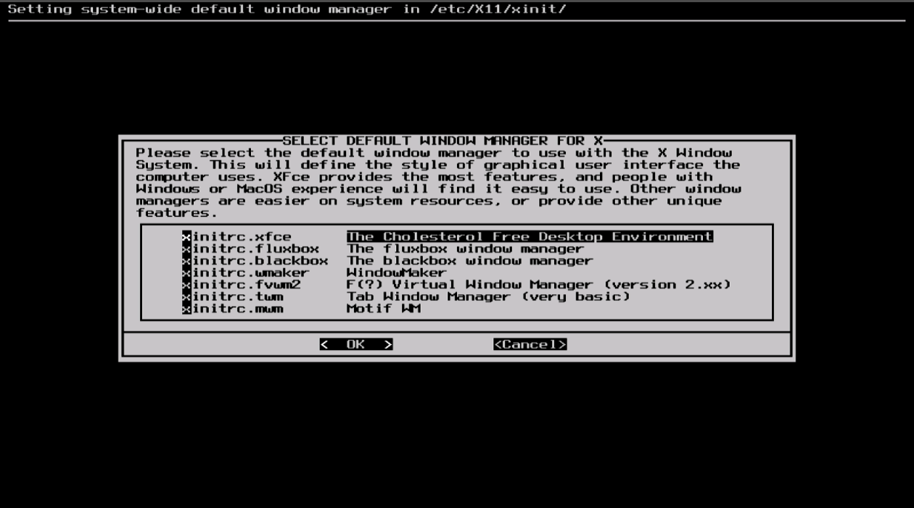

#### Configure

一旦所有的软件包都安装完就快接近结束了。在这一步，Slackware 会让你对新的操作系统进行配置。大多数都是可选的，不过大多数用户都需要在这里设置某些东西。取决于你安装的软件包，你可能看到的配置选项和这里不同，我们会包含一些重要的讲。

LoongArch Slackware 是使用 GRUB2 ，未使用 LILO，所以在 `INSTALL ELILO` 里选择 `skip   Do not install ELILO`

> 译者注：LILO 只是可选的引导程序，Slackware 在“A”（基本系统）软件包组中提供了 GRUB2。

下面会让你配置并激活控制台鼠标用于图形化桌面。通过激活控制台鼠标可以方便地在 Slackware 的终端进行复制和粘贴操作。大部分用户都从前三个选项中进行选择。

下面是配置网络。如果你不想配置网络可以跳过，否则就需要给计算机提供一个主机名。如果你不清楚在做什么可以先看 [第十四章](../../chapter_14/README.md) 。

接下来会让你输入主机名、域名。主机名和域名被用来在使用了内部 DNS 服务的网络中定位计算机或者配置 `/etc/hosts` 文件。默认主机名为“darkstar”。

有三种方法可以配置 IP 地址：分配一个静态的 IP、DHCP 或者配置环回连接。最简单的是使用 DHCP。除非你安装 Slackwar 是作为网络服务器，这样你可能需要配置静态 IP。如果选择配置静态 IP，会让你输入 IP 地址、子网掩码、网关 IP 地址。最后是确认屏幕。

网络配置结束后会进行启动服务的配置。如果你不确定可以使用默认配置，之后可以通过 pkgtool 修改。

之后就是设置时间和时区。

如果你之前选择安装“X”集合，可能会提示你选择一个默认的窗口管理器或者桌面环境。你在这里选择的会应用于系统上的所有用户，除非某个用于运行 `xwmconfig` 来选择一个不同的。如果你看到的选项和下面的图片不同不要惊慌。 `xwmconfig` 只提供你安装的。

最后的配置是设置 root 密码。root 用户是 Linux 中的超级用户。

最后步骤结束后就可以退出 Slackware 安装器并且重启了。移除安装盘，如果你所有安装步骤都正确则会正常启动 Slackware。当你重启并进入 Slackware 系统后，你首先要做的就是新建一个用户。默认情况下，安装结束后只有 root 用户，如果使用 root 用户操作系统会有危险。

最简单的创建用户的方法就是先以 root 用户身份登录，然后输入 `adduser` 命令，详情见 [管理用户和组](../../chapter_09/Managing_Users_and_Groups.md) 章节。
