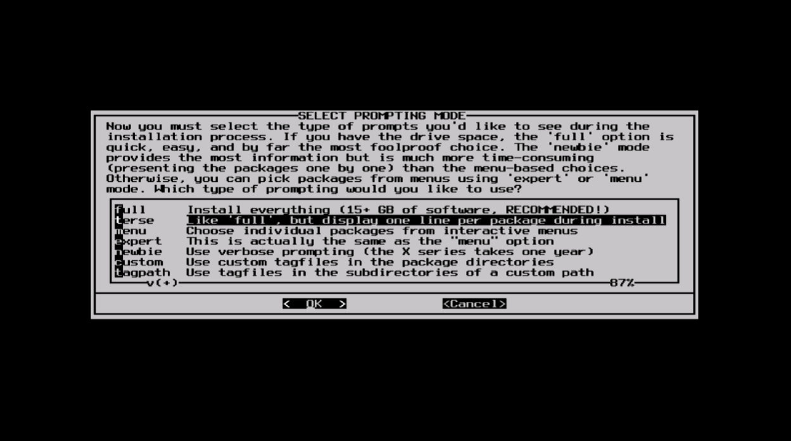

#### Install

最后我们来到了最关键的一环。在这一步中，Slackware会询问你要以哪种方式安装这些选择的软件包。如果这是你第一次安装，推荐选择"full"。

"menu"和"expert"选项允许你选择软件包来安装，这用来给那些对系统熟悉的用户进行选择。这两个方法允许这样的用户快速地对之前选择的集合中的软件包进行删减来构建一个最小化安装的系统。如果你并不知道你在做什么（有时候甚至你知道）你可能会删除一些关键的软件包而导致系统崩溃。

"newbie"对new user（译者注：不知道如何翻译）来说很有用，不过会花费很长时间。这个方法会显示你之前选择的集合中的所有软件包，并且一个个地询问你是否安装。这个方法的好处是可以暂停并且给你一个软件包的简介。对于new user来说，这个简介很有用，而对于大多数用户来说却很费时和乏味。

"custom"和"tagpath"只用于那些对Slackware有技术和专门只是的人。这两个选项允许用于从自定义的tagfiles中安装软件包。Tagfiles很少被用到。我们在这本书中不会讨论。

