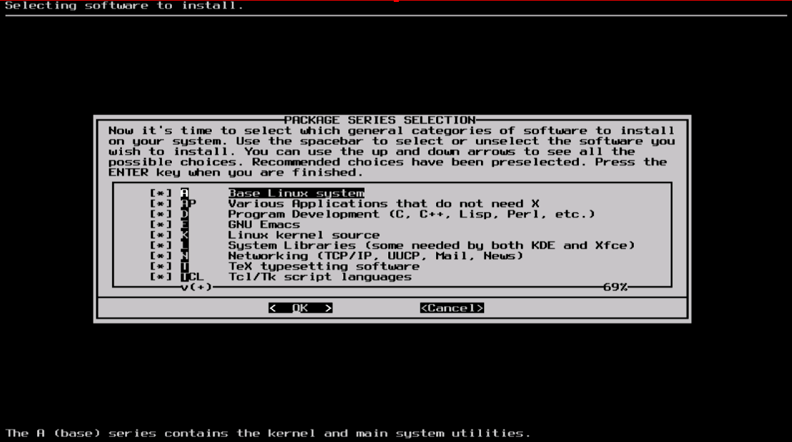

#### Select

Slackware一个独特的特点是将软件包进行了分类。在一开始的时候，FTP网络最多只能以慢速300波特modem的方式接入，所以Slackware将软件包进行分类，这样就可以适用于软盘，用户也已下载并且安装它们感兴趣的软件包。如今这个方式被保留了下来并且安装器允许你选择要安装哪些集合。这允许你跳过一些不需要的软件包，像是服务器上就不需要X和KDE。注意"A"是核心包必须要安装。
