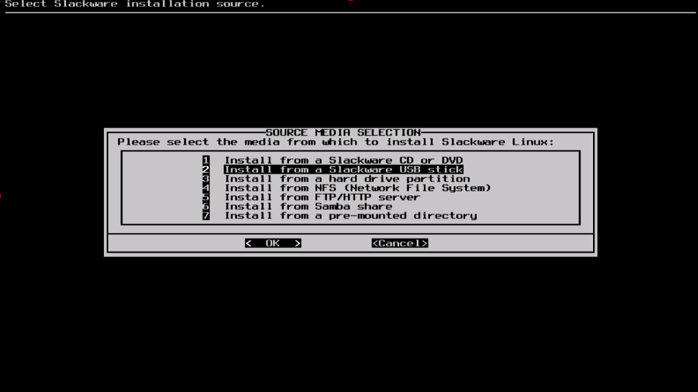

#### Source

这里你可以告诉 Slackware 到哪里寻找 Slackware 的安装包。通常情况下选择从 Slackware 的 DVD 或者 CD 安装，但是也有其他选项。如果你的软件包安装在了一个分区上，你可以从那个分区或者一个预先挂载的目录上安装（你可能需要使用 `mount` 挂载那个分区，详情看 [第十一章](../../chapter_11/README.md)）。除此以外，Slackware 也提供从网络安装，比如 NFS、HTTP、FTP、Samba。如果你选择从网络安装，Slackware 会先让你输入 TCP/IP 信息。我们这里讨论从 DVD 安装，其他方式相似。

