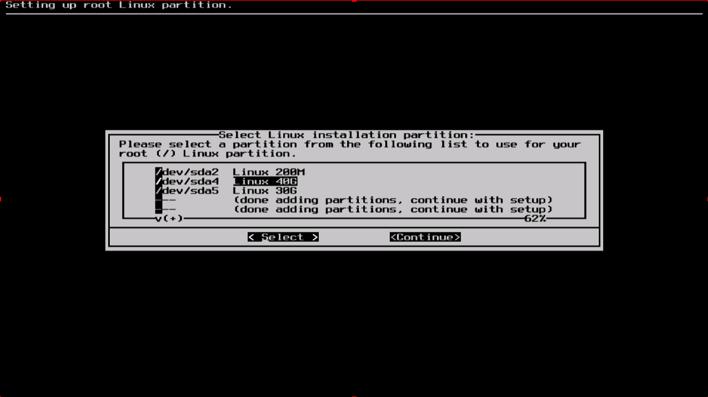

#### Target

我们的下一步是选择root分区以及其他我们需要Slackware使用的分区。在这期间，会有文件系统的选择并且是否用其来格式化分区的选择。如果你安装的是一个新的分区则必须格式化它。如果你以及有一个有数据的分区，并且你像保留数据，则不要格式化。例如大部分用户有一个分开的`/home`分区用来保存用户数据，那么就不要格式化这个分区。这使它们可以安装新的Slackware版本而无需备份和恢复这些用户数据。

