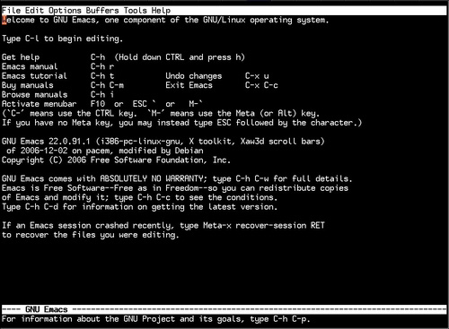

### 起步

打开终端，输入`emacs`，Emacs 就打开了。在字符模式下启动不带参数的`emacs`时，你会看到像这样的东西：

而在 X 窗口模式下时，Emacs 可能会启动带图形界面的版本，如果不喜欢图形界面的版本，你可以在启动时加上`-nw`参数，让它运行在终端里，像这样： `emacs -nw` 。

启动完毕后，你可以用键盘上的方向键移动光标。看到带下划线的字符串了吗？那些都是链接，把光标移动到这些链接上，再敲一下回车就能激活它们。Emacs 附带的文档相当优秀，如果你遇到了问题，可以从中得到帮助。注意 Emacs 文档里描述快捷键的方法有些奇怪，比如`C-h`代表按住`Ctrl`键的同时按一下`h`键，相似的还有`` M-` ``，就是按住`Meta`（其实就是`Alt`）键的同时按一下`` ` ``键。复杂一点的像`C-xC-c`就是按住`Ctrl`，按一下`x`，紧接着再按住`Ctrl`，按一下`c`，这个`C-xC-c`快捷键在 Emacs 中很重要，它的功能是关闭 Emacs。

如果你在启动 Emacs 的时候把一个文件名做为参数传给了它，它就会像 vi 一样打开这个文件，这时等 Emacs 把文件内容呈现出来，就可以开始编辑了。

比方说你启动了一个不带参数的`emacs`，输入了一点东西，想保存一下，可以用快捷键`C-xC-s`。在保存文件时，迷你缓冲区（minibuffer）里会有相应的提示。迷你缓冲区就是在灰色状态行下面的那个空行。然后在迷你缓冲区中输入你想要保存的文件名，按下回车就可以了。如果在迷你缓冲区要求你输入文件名时，你突然不想保存了，这时可以按`C-g`来中止迷你缓存区的输入。

想打开另外一个文件，可又不想退出 Emacs，怎么办呢？用`C-xC-f`，然后迷你缓冲区就会提示你输入一个文件名。Emacs 不会关心你要打开的文件是否存在，如果文件不存在，Emacs 会为它打开一个新缓冲区（buffer），然后等保存时再创建这个文件，如果文件存在则一切照常进行。然而，当你打开一个新文件时，所有已经打开的文件并不会关闭，你可以通过使用快捷键`C-xC-b`切换它们，在迷你缓存区里输入要切换的文件名（从技术上来讲，是缓冲区的名字），然后敲回车。
