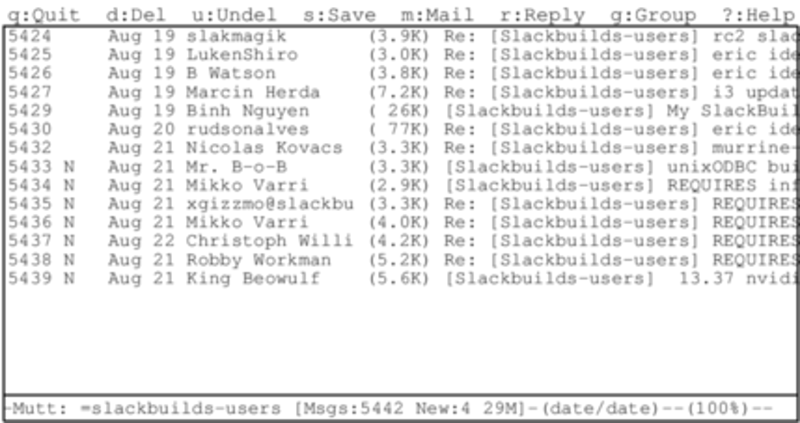

#### mutt

有些人不喜欢`pine`。有些人想要更多控制权。有些人想要一个一切都可以配置并且支持插件的邮件客户端。这些人在用`mutt(1)`。`mutt`不像`pine`那么友好，但它的强大足以弥补这一点。在`mutt`里，你找不到屏幕底部友好的命令提示，因为它把屏幕的每一寸都用来处理邮件了。`mutt`支持广泛的特性——同时显示多封邮件（threaded displays）也没问题。你可以通过`home`目录的`.muttrc`来配置`mutt`，man 手册中有一个专门针对`mutt`选项的说明`muttrc(5)`，你可以去读一下。

`mutt`是独一无二的，因为它其实是一个邮件用户代理（Mail User Agent，MUA），这也意味着他真正的用途是浏览和整理邮件。一开始的确如此，但后来一些像通过 POP3 接收邮件甚至通过 SMTP 进行基本的消息传递这样的附加特性也被添加到了`mutt`中。

健壮的命令行程序常常有很多可配置的选项，`mutt`也是如此，只要它能完成你想要的，就不必去管是用“对”了还是用“错”了。如果你想用`mutt`处理邮件，只需要记住一件事，那就是`mutt`的邮件收发能力极为有限。除了邮件用户代理的基本职责外，`mutt`几乎只关注邮件的整理、浏览和撰写，这也就是所谓的 UNIX 哲学：程序应该只关注一个目标，并尽可能把它做好，让程序能够互相协同工作。因此，要接收邮件你至少要安装一个额外的程序。

`mutt`的浏览命令是高度可配置的，输入`?`可以列出默认的浏览命令。
