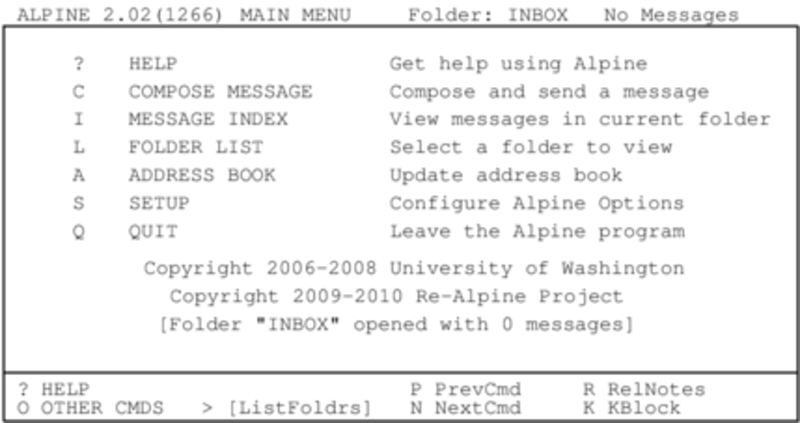

#### pine

`pine`是现存最古老的邮件客户端之一，很少有其他的邮件客户端能比`pine`更加友好。`pine`由华盛顿大学（University of Washington）开发并携带了难对付的商标和版权协议。还好早在2005年，这个大学认为有必要重写一个没有商标的，协议更开放的`pine`，所以`pine`的克隆版本`alpine(1)`诞生了，Slackware中包含的就是这个版本。

要使用`alpine`，在命令行中输入`pine`即可。`pine`用法很简单，它有一个菜单系统，而且要用到的命令在屏幕下方都有说明，来看一下：

在配置任何邮件客户端之前，你都应该去仔细阅读你邮件服务器的文档，只有这样你才能知道邮件服务用了什么协议，采取了那些安全措施，这些信息有助于你正确地配置邮件客户端。默认状态下，`pine`会在你计算机上运行的邮件服务中检查新邮件。除非你的计算机的确在运行这么一个邮件服务（很多人这么做），否则这恐怕不是你想要的。幸运的是配置`pine`非常容易，进入[S]etup菜单，选择[C]onfig选项，你就能看到一个能让你输入你名字、邮箱地址、和SMTP服务器的选项还有其他一些选项。

