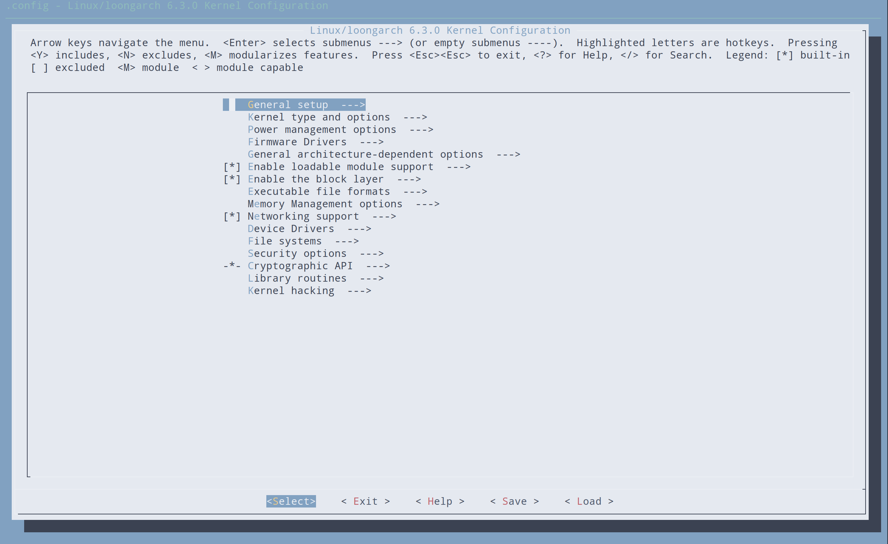

### 编译以及为什么要编译内核

大部分 Slackware 用户永远都不需要自己编译内核，因为 Slackware 提供的 huge 和 generic 两种内核几乎包含了你所需要的所有支持。

> 译者注：这里的“huge”和“generic”内核分别对应“[mkinitrd](../chapter_03/mkinitrd.md)”一节中所说的“巨型”和“通用”内核。

但是，仍然有一部分用户需要自己编译内核。如果你的计算机包含了最新的硬件，一个更新版本的内核或许可以为你提供改进的支持。有时，一个内核分支或许可以修复你遇到的错误。在这种情况下，你就有理由编译一个内核。那些只是想升级到最新版内核或者认为一个编译的内核可以为自己带来更高的性能的人当然可以升级，但是他们通常不会注意内核的任何重大变化。

如果你仍然认为编译一个内核是你所想要或需要的，在这一节我们将会带你经历编译内核的许多步骤。编译并安装一个内核并没有那么难。但是在这个过程中可能会出现一些错误，它们中的许多都可能导致你的计算机无法开机并且给你带来巨大的挫败感。

首先要确保你已经将内核源码安装到你的计算机上。内核源码包包含在安装器的“K”包组中，你也可以从 [https://www.kernel.org/](https://www.kernel.org/) 下载其他版本的内核源码。内核源码通常被放在 `/usr/src/linux` 目录里。有一个符号链接用来指向特定的内核版本，但这并不是一成不变的，你可以把内核源码移动到任何位置并且不造成任何错误。

```
darkstar:~# ls -l /usr/src
lrwxrwxrwx  1 root root   14 2009-07-22 19:59 linux -> linux-2.6.29.6/
drwxr-xr-x 23 root root 4096 2010-03-17 19:00 linux-2.6.29.6/
```

编译内核最困难的一部就是内核的配置。内核中有数以百计的选项，它们中的许多也可以被编译为模块。这意味着内核有上千种不同的配置。幸运的是，我们有一些方便的技巧来为你免去许多麻烦。内核的配置文件是 `.config` 。如果你非常有勇气，你可以用一个文本编辑器手动编辑这个文件。但我们强烈推荐你使用内核自建工具来配置 `.config` 。

除非你对内核配置非常熟悉，否则你首先得有一个可靠的基础内核配置文件，然后再来修改它。这可以防止你错过某个重要的选项，而这个选项有可能导致你不得不一次又一次地编译内核直到编译正确。最好的办法是从使用过的默认 `.config` 配置文件开始配置内核。你可以在安装盘或者你喜欢的镜像源的 `kernels/` 目录里找到这个文件。

```
darkstar:~# mount /mnt/cdrom
darkstar:~# cd /mnt/cdrom/kernels
darkstar:/mnt/cdrom/kernels# ls
VERSIONS.TXT  huge.s/  generic.s/  speakup.s/
darkstar:/mnt/cdrom/kernels# ls genric.s
System.map.gz  bzImage  config
```

你可以轻松地下载或复制你想要的 `config` 文件替换 `.config` 来作为内核配置的基础文件。这里我使用了推荐的 generic 内核作为基础，你也可以使用 huge 内核的配置文件。generic 内核将更多选项建立为模块，从而减小内核映像的大小，但它通常需要使用 initrd。

```
darkstar:/mnt/cdrom/kernels# cp generic.s/config /usr/src/linux/.config
```

> 重要：
>
> 提供的内核配置文件前没有 `.`，而真正的内核配置文件前有 `.` 。如果你忘记了，或者只是简单的把 `config` 文件复制到 `/usr/src`，那么以前存在的 `.config` 文件将会被使用。

如果你想把当前运行的内核的配置文件作为基础配置文件，你可以在 `/proc/config.gz` 里面找到它。这是一个特殊的内核相关的文件，其中包括以压缩格式保存的整个内核配置，并要求你的内核支持它。

```
    darkstar:~# zcat /proc/config.gz > /usr/src/linux/.config
```

既然我们已经有了一个可靠的基础配置文件，是时候按照我们的需求更改配置了。这将逐步完成你的 `.config` 文件。 这将会配置并寻找缺少的元素，这通常表示新内核版本包含新增的选项。因为在几乎每一个内核版本中都会新增一些选项，这通常是一件好事。

```
darkstar:/usr/src/linux# make oldconfig
scripts/kconfig/conf -o arch/x86/Kconfig
*
* Restart config...
*
*
* File systems
*
Second extended fs support (EXT2_FS) [M/n/y/?] m
  Ext2 extended attributes (EXT2_FS_XATTR) [N/y/?] n
  Ext2 execute in place support (EXT2_FS_XIP) [N/y/?] n
Ext3 journalling file system support (EXT3_FS) [M/n/y/?] m
  Ext3 extended attributes (EXT3_FS_XATTR) [Y/n/?] y
    Ext3 POSIX Access Control Lists (EXT3_FS_POSIX_ACL) [Y/n/?] y
    Ext3 Security Labels (EXT3_FS_SECURITY) [Y/n/?] y
The Extended 4 (ext4) filesystem (EXT4_FS) [N/m/y/?] (NEW) m
```

从上面你可以看到，我正在编译的内核新增了对 ext4 的支持 `oldconfig` 已经按照我原先的配置进行设置了，保留了所有旧选项的设置，仅仅让我对新增的选项进行配置。通常这可以不用选择默认选项，但是你可能希望改变它们。 `oldconfig` 可以方便的只显示给你新增的选项，非常适合那些只是想尝试最新版内核的用户。

对于更细致的配置任务，我们也有多种选项。 Linux 内核可以通过三种主要方式进行配置。第一个是 `config`，将逐一显示每个选项让你进行配置。这是这个过程实在过于冗长，几乎已经没有人使用它了。

```
darkstar:/usr/src/linux# make config
scripts/kconfig/conf arch/x86/Kconfig
*
* Linux Kernel Configuration
*
*
* General setup
*
Prompt for development and/or incomplete code/drivers (EXPERIMENTAL) [Y/n/?] Y
Local version - append to kernel release (LOCALVERSION) [] -test
Automatically append version information to the version string (LOCALVERSION_AUTO) [N/y/?] n
Support for paging of anonymous memory (swap) (SWAP) [Y/n/?]
```

幸好我们还有两种更简单的方法来配置内核，它们就是 `menuconfig` 和 `xconfig` 。这两种方式都会创建一个菜单程序，允许您选择和取消选择选项，而不必逐一进行选择。 `menuconfig的 ` 是最常用的方法，而且我也推荐这种方法。 `xconfig` 仅在当您试图使用一个图形用户界面在 X 上编译内核时才会有用。它们两个非常相似，但我们这里只会介绍 `menuconfig` 。

在终端上运行 `make menuconfig` 就会出现下面的菜单界面。每个内核部分都有自己的子菜单，您可以用方向键进行选择。



> 警告：
>
> 如果您在编译内核和 Slackware 软件仓库里的内核版本相同，你必须选择“Local version”选项。这个选项可以在“General setup”子菜单中找到。如果不设置这将导致你的内核编译的模块覆盖 slackware 你从仓库安装的内核的模块。这将很快导致你的系统无法引导。

一旦你已经配置好了内核，那么你就该进行编译了。有很多方法进行编译，但是最可靠的使用 `bzimage` 参数。当你一旦开始通过这个参数进行 `make`，内核就会开始进行编译，你将会看到终端上滚动许多信息，知道内核编译完成或者遇到了一个致命错误。

```
darkstar:/usr/src/linux# make bzImage
scripts/kconfig/conf -s arch/x86/Kconfig
  CHK     include/linux/version.h
  CHK     include/linux/utsrelease.h
  SYMLINK include/asm -> include/asm-x86
  CALL    scripts/checksyscalls.sh
  CC      scripts/mod/empty.o
  HOSTCC  scripts/mod/mk_elfconfig
  MKELF   scripts/mod/elfconfig.h
  HOSTCC  scripts/mod/file2alias.o
... many hundreds of lines ommitted ...
```

如果编译过程因为错误而中止，你首先应该检查你的内核配置。编译错误通常是由错误的 `.config` 文件导致的。如果你成功完成了上面的步骤，内核的编译仍然没有完全结束，我们还需要构建模块。

```
darkstar:/usr/src/linux# make modules
  CHK     include/linux/version.h
  CHK     include/linux/utsrelease.h
  SYMLINK include/asm -> include/asm-x86
  CALL    scripts/checksyscalls.sh
  HOSTCC  scripts/mod/file2alias.o
... many thousands of lines omitted ...
```

如果内核和模块的编译都已经完成，我们就可以安装内核了，内核镜像文件需要被复制到一个安全的位置，通常是在 `/boot` 目录下，而且你应该对他进行重命名以防止覆盖其他内核镜像。通常内核被命名为 `vilinuz` 后面跟上内核版本号和本地版本。

```
darkstar:/usr/src/linux# cat arch/x86/boot/bzImage > /boot/vmlinuz-release_number-local_version
darkstar:/usr/src/linux# make modules_install
```

一旦完成上述步骤，你的 `/boot` 目录下就会有一个新内核，并且 `/lib/modules` 目录下会有新内核的模块。为了使用这个新内核，你需要编辑 `lilo.conf` 文件，为他创建一个 initrd（仅在你需要在开机时加载一个或多个这个内核的模块），然后运行 `lilo` 进行更新。当你重启时，如果一切按计划顺利进行，你就会看到一个使用你新编译的内核启动的选项。如果出现了什么问题，你可能花费需要一些时间来修复。
